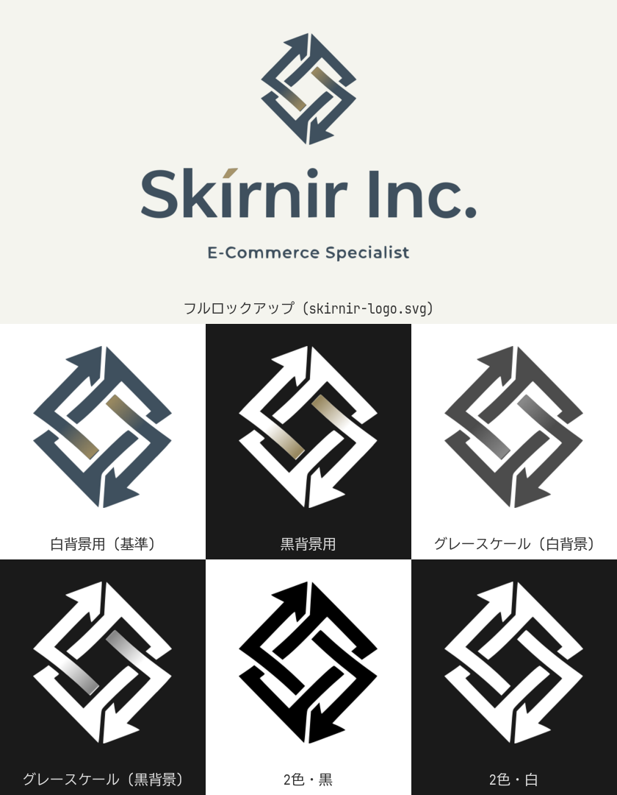
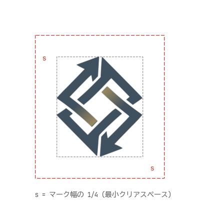
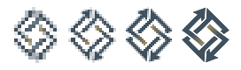
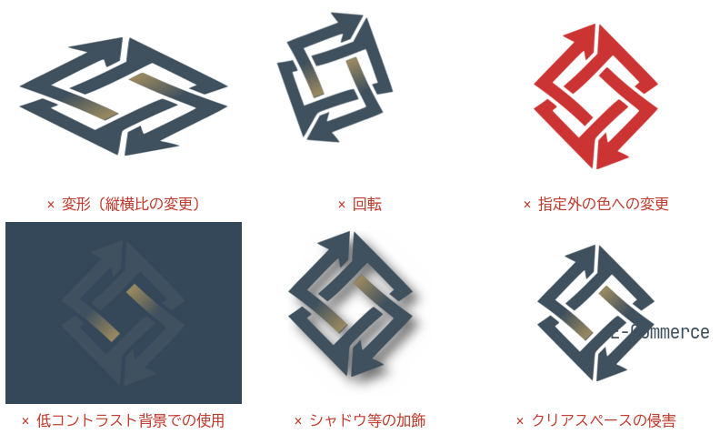

# Skírnir Inc. ロゴ使用レギュレーション

スキルニル株式会社のロゴの使用規定です。社内外の制作物 (Web・印刷・グッズ等) でロゴを使用する際は本規定に従ってください。

## 1. ロゴの構成

ロゴは以下の要素で構成されます。

| 要素 | 内容 |
|---|---|
| シンボルマーク | 2 本の矢印が組み合った菱形のモノグラム。循環・連携を象徴 |
| ロゴタイプ | 「Skírnir Inc.」(í のアクセント記号はゴールド) |
| タグライン | 「E-Commerce Specialist」 |

使用形態は 2 種類です。

- **フルロックアップ** (マーク + ロゴタイプ + タグライン): 十分な表示面積がある場合の基本形
- **マーク単体**: アイコン・favicon・SNS アバター等の省スペース用途

## 2. ロゴデータ一覧

すべて `public/images/` に配置しています。

| ファイル | 形態 | 用途 |
|---|---|---|
| `skirnir-logo.svg` | フルロックアップ | 白・明色背景 |
| `skirnir-logo_only.svg` | マーク単体 (基準) | 白・明色背景 |
| `skirnir-logo_only_dark.svg` | マーク単体 | 黒・暗色背景 |
| `skirnir-logo_only_grayscale.svg` | マーク単体 | モノクロ媒体・白背景 |
| `skirnir-logo_only_grayscale_dark.svg` | マーク単体 | モノクロ媒体・黒背景 |
| `skirnir-logo_only_black.svg` | マーク単体 (黒 1 色) | 2 値印刷・FAX・刻印・型抜き |
| `skirnir-logo_only_white.svg` | マーク単体 (白 1 色) | 2 値・暗色地への刻印・型抜き |
| `favicon.ico` | マーク単体 (16/24/32/64px) | ブラウザ favicon |

原則としてこれらの支給データをそのまま使用し、再作図・再着色は行わないでください。

## 3. カラー規定

| 名称 | HEX | RGB | CMYK (参考値) | 用途 |
|---|---|---|---|---|
| ブランドネイビー | `#3F505E` | 63, 80, 94 | 33, 15, 0, 63 | マーク本体・ロゴタイプ |
| ブランドゴールド | `#988860` | 152, 136, 96 | 0, 11, 37, 40 | マーク中央のグラデーション起点 |
| アクセントゴールド | `#A6946B` | 166, 148, 107 | 0, 11, 36, 35 | ロゴタイプ「í」のアクセント記号 |
| 背景クリーム | `#F4F4EE` | 244, 244, 238 | 0, 0, 2, 4 | 推奨背景色 (任意) |

- マーク中央の 2 本のバーは **ブランドゴールド → ブランドネイビーの線形グラデーション** です。グラデーションの方向・位置は変更しないでください
- CMYK 値は RGB からの単純変換による参考値です (未検証)。印刷時は必ず色校正で確認してください

## 4. バリエーションの使い分け

| 背景 | 使用するデータ |
|---|---|
| 白 〜 明るい背景 (推奨: 白または `#F4F4EE`) | 基準版 (`skirnir-logo.svg` / `skirnir-logo_only.svg`) |
| 黒 〜 暗い背景 | `_dark` 版 |
| モノクロ媒体 (グレースケール印刷等) | `_grayscale` / `_grayscale_dark` 版 |
| 2 値表現 (FAX・刻印・型抜き・単色印刷) | `_black` / `_white` 版 |

背景の明度が中間 (ネイビーに近い明度) の場合はロゴが埋没するため使用しないでください (「7. 禁止事項」参照)。写真の上に置く場合は、ロゴ周辺が十分に明るい (または暗い) 均質な領域を選んでください。

## 5. クリアスペース

ロゴの周囲には、**マーク幅の 1/4 (= s)** 以上の余白 (クリアスペース) を確保してください。クリアスペース内に文字・図形・他のロゴを配置してはいけません。フルロックアップの場合も同様に、ロゴ全体の外接矩形からマーク幅の 1/4 を確保します。

## 6. 最小使用サイズ

| 形態 | デジタル | 印刷 (参考値) |
|---|---|---|
| フルロックアップ | 幅 160px 以上 | 幅 30mm 以上 |
| マーク単体 | 高さ 24px 以上 | 高さ 8mm 以上 |

- タグラインが判読できないサイズではフルロックアップを使わず、マーク単体に切り替えてください
- 24px 未満のサイズが必要な場合 (favicon 等) は、小サイズ向けに調整済みの `favicon.ico` を使用してください。ベクターデータの単純縮小では切れ込みが潰れます

## 7. 禁止事項

以下の加工・使用を禁止します。

1. **変形**: 縦横比の変更、斜体化、パースをつける
2. **回転**: 角度を変えて使用する
3. **色変更**: 規定色以外への変更、グラデーションの削除・方向変更 (単色化が必要な場合は `_black` / `_white` 版を使用)
4. **低コントラスト背景での使用**: ネイビーに近い明度の背景に基準版を置く
5. **加飾**: ドロップシャドウ、縁取り、光彩、透過などのエフェクト追加
6. **クリアスペースの侵害**: 規定の余白内への文字・図形の配置

このほか、マークとロゴタイプの位置関係の変更、要素の分解・再構成、パターンとしての敷き詰め使用も禁止します。

## 8. 改訂履歴

| 日付 | 内容 |
|---|---|
| 2026-07-10 | 初版作成 |
